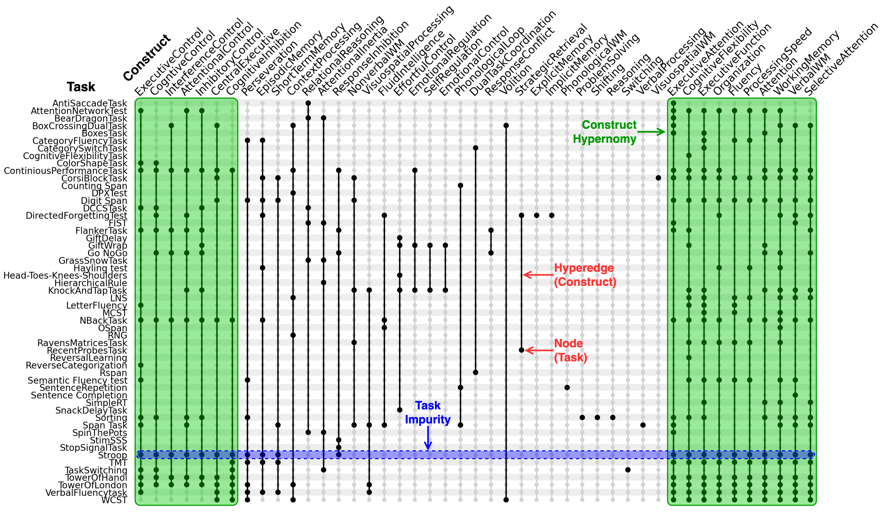
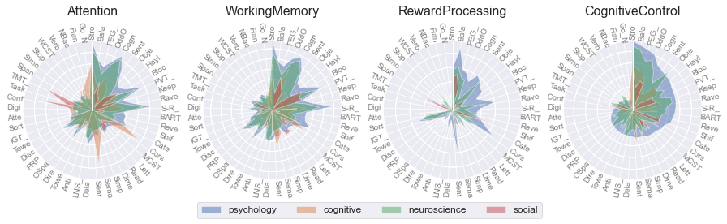

#### **PhD Defense**

## Towards a Computational Model of General Cognitive Control Using Artificial Intelligence, Experimental Psychology and Cognitive Neuroscience

 

#### Morteza Ansarinia
##### University of Luxembourg
##### January 30, 2023

---

# Towards a Computational Model of General <mark>Cognitive Control</mark> Using Artificial Intelligence, Experimental Psychology and Cognitive Neuroscience

<!--
::: {.notes}

My thesis aims to further our understanding of higher-order cognition. More specifically, I'm interested in our ability to be goal-driven and which enables us to produce complex, meaningful, context-dependent behavior, in uncertain environments, inhibit prepotent responses, monitor and manage the cross-talk between conflicting tasks.

:::
-->

---

# Introduction & problem definition

---

# Defining Cognitive Control

* One
* Two
* Three

- one
- two
- three

---

## **Article 1:**   Linking Theories and Methods in Cognitive Sciences via Joint Embedding of the Scientific Literature: The Example of Cognitive Control

---

Figures:

- Descriptive plots
- Pipeline
- Formulas
- Hypergraph
- Construct hypernomy across diciplines
- Task-task similarity
- Task recommender UI

---

<!-- backgroundColor: white -->

---
<!-- backgroundColor: white -->

---

# Modeling Cognitive Control

---

## Article 2: CogEnv

Figures:

- Architecture
- Tasks
- Agents playing tasks
- Expected performance profiles

---

## Article 3: CogPonder

Figures:

- Before/after CogPonder wrap
- Formulas
- Stroop
- N-back
- RT distributions
- CogPonder performing a task

---

# Training Cognitive Control

---

## Article 4: OxfordCh

Figures

- Generes
- Brain structures and functions

---

## Article 5: ACNets

Figures

- Formulas
- Accuracies given parcellation and connectivity metric
- Feature importaance
- Atlases
- Head motion
- SHAP

---

## General conclusion

---

## Summary

Thesis structure

---

## Future works

Figures:

- CogEnv
- CogPonder+CogEnv architecture

---

## Acknowledgements
